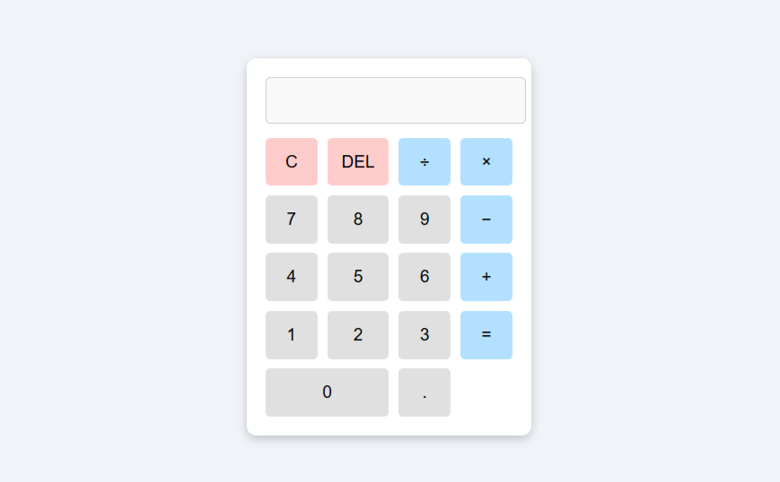

#  Simple Calculator

A **beginner-friendly calculator** built using HTML, CSS, and JavaScript.  
It performs basic arithmetic operations like addition, subtraction, multiplication, and division.

---

##  Features
- Simple and clean interface  
- Works instantly in any browser  
- Easy-to-understand code   
- Clear (C) and Delete (DEL) buttons  

---

##  How to Use
1. Download or clone the repository  
2. Open `index.html` in your browser  
3. Click the buttons to perform calculations  

---

##  Preview

---

##  Project Structure

|-- index.html # Main HTML file
|-- style.css # Styling for calculator
|-- script.js # JavaScript logic
|-- README.md # Project documentation
|-- screenshot.png # Screenshot of the calculator

---
----

👩🏻‍💻 **Created by Niveditha**

